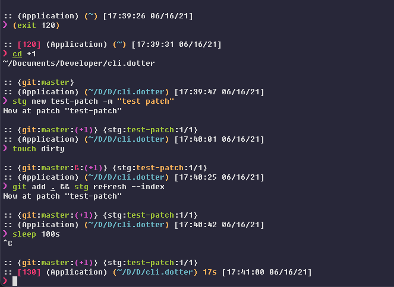

# Pure:Ish

> Sorta-pretty, kinda-minimal, but definitely fast and useful ZSH prompt.



## Overview

> Mad Props to: [Sindre Sorhus](https://github.com/sindresorhus), for an amazing base for this enhancement.

I like my prompts clean, useful and fast. I did really like the aesthetic of the pure prompt, but it was a little too barebones for me.

This prompt has a few improvements over pure, for the info junkie:

- Cleaned up / Organized functions in `pure.zsh`.
- Improved the git/hg statuses to my liking.
- Visually separated sections, for easier visual parsing at a glance.
- Long directories now get truncated in the middle with an elipsis.
- Added timestamps for all commands.
    - (For the crazy people that leave their sessions running for days on end.)
    - (And make you painfully aware of how late it is right now probably.)
- No unicode characters in the prompt, aside from the prompt character.
    - (To keep even most barebones terminals happy. Looking at you ItelliJ (X_X)... )
- If non-zero, the error code of the last command is displayed.
    - (Makes it super nice to test shell commands / know exactly what happened in case of an error.)

<!-- ### Why?

- Comes with the perfect prompt character.
  Author went through the whole Unicode range to find it.
- Shows `git` branch and whether it's dirty (with a `*`).
- Indicates when you have unpushed/unpulled `git` commits with up/down arrows. *(Check is done asynchronously!)*
- Prompt character turns red if the last command didn't exit with `0`.
- Command execution time will be displayed if it exceeds the set threshold.
- Username and host only displayed when in an SSH session.
- Shows the current path in the title and the [current folder & command](screenshot-title-cmd.png) when a process is running.
- Support VI-mode indication by reverse prompt symbol (Zsh 5.3+).
- Makes an excellent starting point for your own custom prompt. -->


## Install

Requires Git 2.0.0+ and ZSH 5.2+. Older versions of ZSH are known to work, but they are **not** recommended.

### Install With Antibody [link](https://github.com/getantibody/antibody)

Update your `.zshrc` file with the following two lines (order matters):

```sh
antibody bundle mafredri/zsh-async
antibody bundle sindresorhus/pure
```

## Getting started

Initialize the prompt system (if not so already) and choose `pure`:

```sh
# .zshrc
autoload -U promptinit; promptinit
prompt pure
```

## Options

| Option                           | Description                                                                                    | Default value  |
| :------------------------------- | :--------------------------------------------------------------------------------------------- | :------------- |
| **`PURE_CMD_MAX_EXEC_TIME`**     | The max execution time of a process before its run time is shown when it exits.                | `5` seconds    |
| **`PURE_GIT_PULL=0`**            | Prevents Pure from checking whether the current Git remote has been updated.                   |                |
| **`PURE_GIT_UNTRACKED_DIRTY=0`** | Do not include untracked files in dirtiness check. Mostly useful on large repos (like WebKit). |                |
| **`PURE_GIT_DELAY_DIRTY_CHECK`** | Time in seconds to delay git dirty checking when `git status` takes > 5 seconds.               | `1800` seconds |
| **`PURE_PROMPT_SYMBOL`**         | Defines the prompt symbol.                                                                     | `❯`            |
| **`PURE_PROMPT_VICMD_SYMBOL`**   | Defines the prompt symbol used when the `vicmd` keymap is active (VI-mode).                    | `❮`            |
| **`PURE_GIT_DOWN_ARROW`**        | Defines the git down arrow symbol.                                                             | `⇣`            |
| **`PURE_GIT_UP_ARROW`**          | Defines the git up arrow symbol.                                                               | `⇡`            |

## Example

```sh
# .zshrc

autoload -U promptinit; promptinit

# optionally define some options
PURE_CMD_MAX_EXEC_TIME=10

prompt pure
```

## Tips

In the screenshot you see Pure running in [Hyper](https://hyper.is) with the [hyper-snazzy](https://github.com/sindresorhus/hyper-snazzy) theme and Menlo font.

The [Tomorrow Night Eighties](https://github.com/chriskempson/tomorrow-theme) theme with the [Droid Sans Mono](https://www.fontsquirrel.com/fonts/droid-sans-mono) font (15pt) is also a [nice combination](https://github.com/sindresorhus/pure/blob/95ee3e7618c6e2162a1e3cdac2a88a20ac3beb27/screenshot.png).<br>
*Just make sure you have anti-aliasing enabled in your terminal.*

To have commands colorized as seen in the screenshot, install [zsh-syntax-highlighting](https://github.com/zsh-users/zsh-syntax-highlighting).

## FAQ

There are currently no FAQs.

See [FAQ Archive](https://github.com/sindresorhus/pure/wiki/FAQ-Archive) for previous FAQs.

## Team

| Contributors | |
| :-- | :-- |
|  | NonLogical (The Modder) |
| [](http://sindresorhus.com) | [Sindre Sorhus](https://github.com/sindresorhus) (The Original Author) |
| [](https://github.com/mafredri) | [Mathias Fredriksson](https://github.com/mafredri) (The Original Author) |


## License

MIT © [Sindre Sorhus](https://sindresorhus.com)
